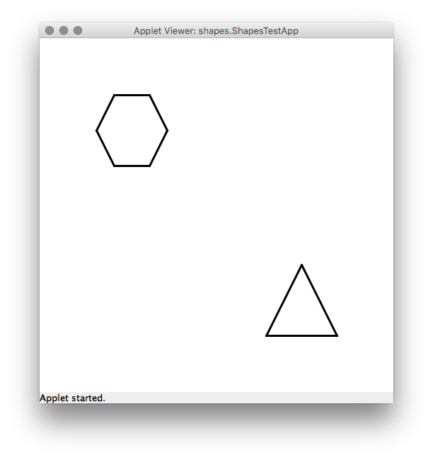

# U20 | Neue Shapes für die GraphicsApp

Erweitern Sie die Funktionalität der `GraphicsApp` um zwei neue Formen:
Ein gleichschenkliges Dreieck (`Triangle`) sowie ein
Achsen-symmetrisches Sechseck (`Hexagon`).

Erstellen Sie hierzu zwei `.java`-Klassendateien im Ordner `Shapes` in Ihrem Starterpaket. Beide Formen werden durch Java-Klassen abgebildet, die von `GraphicsObject` erben. Die Darstellung erfolgt in der überschriebenen `draw`-Methode durch
Zeichnen der Umrisslinien. Das Innere der Formen muss nicht eingefärbt
bzw. dargestellt werden. Testen Sie anschließend Ihre Anwendung, in dem
Sie die auskommentierten Zeilen in `ShapesTest` durch Entfernen der
Kommentare nutzbar machen. Haben Sie die
Klassen korrekt implementiert, sollten Sie die neuen Formen auf dem
Bildschirm sehen.

Bewegen Sie außerdem das Sechseck von einer Startposition aus nach oben links und das Dreieck
nach unten rechts.

**Hinweise:** Speichern Sie in den Klassen die jeweiligen Eckpunkte und
zeichnen Sie beim Aufruf von `draw` die Verbindungslinien zwischen
diesen Punkten. Die Klasse `GraphicsObject` verfügt über Variablen und
Methoden zur Abbildung eines Koordinatenpaars (x und y). Nutzen Sie
diesen Punkt als Zentrum bzw. Schwerpunkt für Ihre neuen Formen und
berechnen Sie die anderen Punkte auf dieser Basis. Denken Sie daran,
dass die verschiedenen Methoden des `GraphicsObject` die x- und
y-Koordinaten beeinflussen und Sie die Eckpunkte Ihrer Form regelmäßig
(z.B. vor jedem Zeichnen) neu berechnen müssen.

| Diese neuen Formen sollen Sie ergänzen |
|:------:|
|  |
